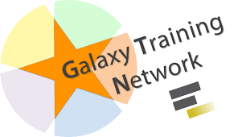

# The Galaxy Platform  

<!--  -->

Galaxy is a web platform for bioinformatics analysis. 

## Which Galaxy should I use? 

- There are many different Galaxy servers - each one has a different web address.
    
- For researchers based in Melbourne, Australia, we recommend you use [Galaxy-Mel](https://galaxy-mel.genome.edu.au/galaxy/).

- The main worldwide Galaxy server is [https://usegalaxy.org/](https://usegalaxy.org/)

- Other Galaxy servers are listed [here](https://galaxyproject.org/public-galaxy-servers/).

- Check the policy for the server you are using so that you know how long your data will be kept. 

- If you use more than one Galaxy server (e.g. Galaxy-Mel and useGalaxy.org) you need to register and log in separately for each server. They don't talk to each other. 

## Tutorials

<!-- to do: check these run on Galaxy-Mel (or Galaxy-Au) - especially the GTN ones -->

Go to Galaxy-Mel and log in, then try these tutorials:

* [Introduction to Galaxy](../tutorials/galaxy_101/galaxy_101.md) 
* [Galaxy Workflows](../tutorials/galaxy-worklows/galaxy-workflows) 
* Other MB tutorials, e.g. Assembly, RNA-seq, etc. 

## Galaxy Training Network

The Galaxy Training Network hosts a large collection of useful training material [here](http://galaxyproject.github.io/training-material/).

To get started, go to [https://usegalaxy.org/](https://usegalaxy.org/), log in, then try these tutorials: 

* [Introduction to Galaxy](http://galaxyproject.github.io/training-material/topics/introduction/tutorials/galaxy-intro-101/tutorial.html)
* [Galaxy histories](http://galaxyproject.github.io/training-material/topics/introduction/tutorials/galaxy-intro-history/tutorial.html)

